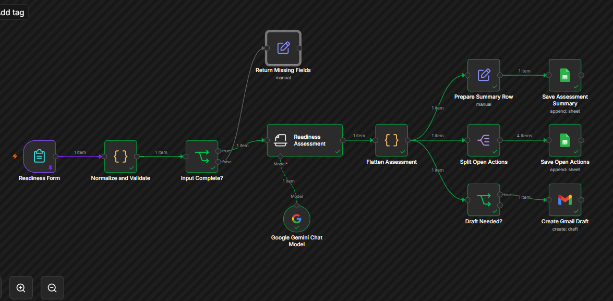
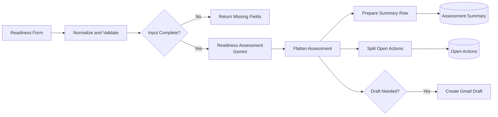
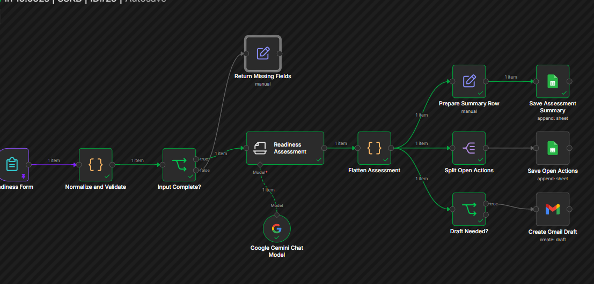
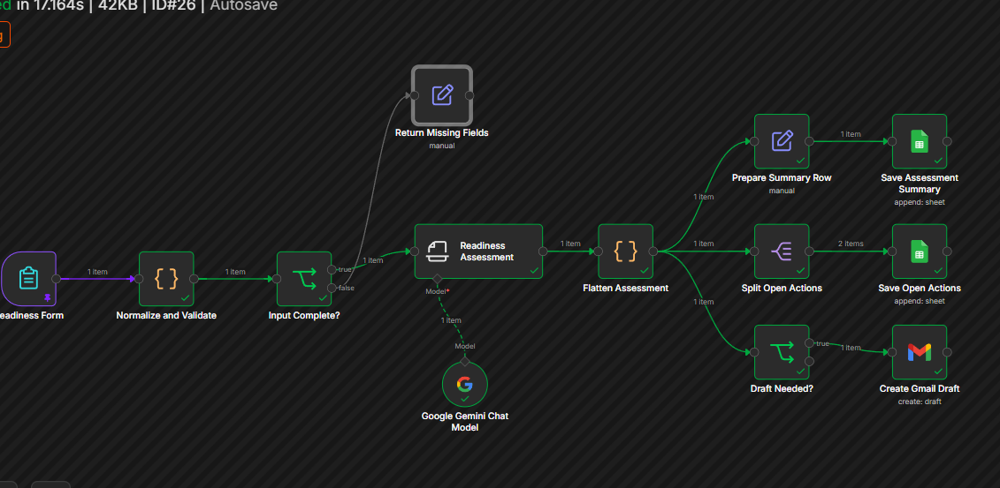
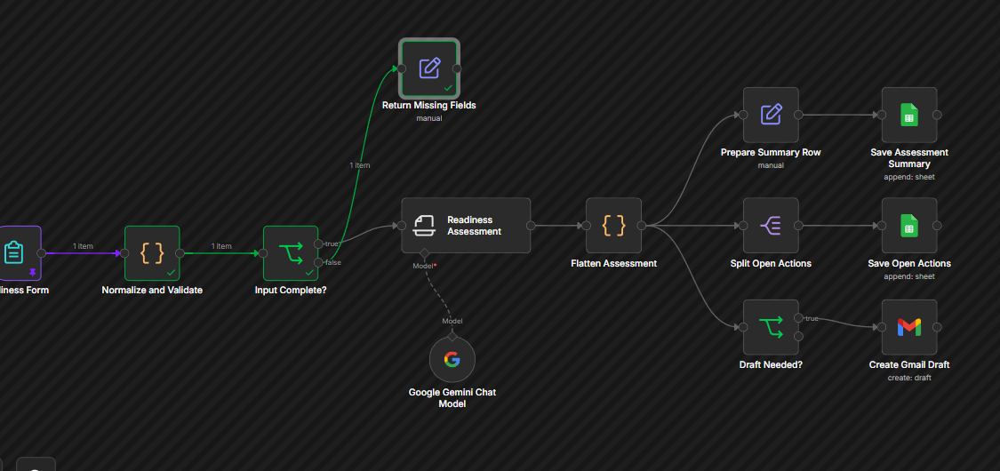

# Medical Device Implementation Readiness AI Agent

An n8n workflow that uses Gemini to review **fictional** laboratory implementation details, flag missing prerequisites, assign follow-up ownership, and log the results to Google Sheets. When critical gaps exist, it creates a Gmail **draft** for a human to review. It never sends email on its own.

> **Fictional portfolio demonstration.** This is not a validated medical-device system. Do not use it for clinical decisions, patient care, emergency response, or production service operations. All facilities, devices, people, dates, and email addresses in this project are invented.



## Problem

Instrument implementations at a lab site depend on many things being ready at once: space, electrical, network and LIS connectivity, water and drain, reagents, staffing, training, and verification studies. When one item is missing close to go-live, the delay is often found late and follow-up ownership is unclear. This project explores how AI-assisted triage, with a human in the loop, can make those gaps visible earlier and track who owns each one.

## What it does

1. Collects fictional implementation details through an n8n form.
2. Checks that the required information is present. Incomplete submissions never reach the AI.
3. Uses Gemini to return a structured assessment: a preliminary status (Ready, Conditionally Ready, or Not Ready), a score, critical gaps, and open actions.
4. Saves one summary row per assessment to a Google Sheet.
5. Saves each open action as its own row in a second tab, with an owner role, target date, criticality, and evidence needed.
6. Creates a Gmail draft when the result is Not Ready, or Conditionally Ready with a High or Critical gap. A person reviews and decides whether to send it.

## Architecture



| Stage | n8n component | Purpose |
| --- | --- | --- |
| 1 | Form Trigger | Collect fictional implementation-readiness information |
| 2 | Code | Normalize fields, build an assessment ID, and list missing required inputs |
| 3 | IF | Continue only when the minimum information is present |
| 4 | Information Extractor + Google Gemini Chat Model | Produce a structured readiness assessment |
| 5 | Code, Set, Split Out | Flatten the assessment and split individual open actions |
| 6 | Google Sheets (x2) | Append the summary row and the action rows |
| 7 | IF + Gmail (Create Draft) | Prepare a draft only when routing rules call for it |

## Routing rules

| Condition | Action |
| --- | --- |
| Ready | Save the assessment. No draft. |
| Conditionally Ready | Save the assessment and actions. Draft a follow-up only if a High or Critical gap exists. |
| Not Ready | Save the assessment and actions. Draft an escalation email. |
| Required field missing | Do not call the AI. Return the missing fields. |

## Structured output

Gemini returns this shape. The workflow validates the status and criticality values and treats an unapproved status as Not Ready, so a person reviews it.

```json
{
  "assessmentId": "IMPL-2026-001",
  "readinessStatus": "Conditionally Ready",
  "readinessScore": 72,
  "summary": "Short factual summary",
  "criticalGaps": ["Network drop not verified"],
  "openActions": [
    {
      "requirementArea": "Network and LIS",
      "missingItem": "Confirm network drop activation",
      "ownerRole": "IT or LIS",
      "targetDate": "2026-11-05",
      "criticality": "High",
      "evidenceNeeded": "Written confirmation or completed checklist",
      "reason": "Connectivity readiness is not clearly confirmed"
    }
  ],
  "humanReviewStatus": "Pending"
}
```


## Test cases

I ran four fictional scenarios in n8n by pinning mock form data on the trigger node.

| Test | Scenario | Result observed |
| --- | --- | --- |
| A | All prerequisites documented and confirmed | Ready, score 100. Summary row saved. No open actions. No draft. |
| B | Training date missing and reagent delivery pending | Conditionally Ready. Two open actions saved (Gemini rated both Critical), so a follow-up draft was created. |
| C | Electrical circuit and network drop not confirmed close to go-live | Not Ready, score 25. Four open actions saved. Escalation draft created. |
| D | Required field (Electrical Readiness) left empty | Validation failed and reported the missing field. The AI node did not run, nothing was saved, and no draft was created. |

In every test the Gmail Sent folder stayed empty, confirming the workflow only creates drafts.

**Test A: Ready**



**Test B: Conditionally Ready**



**Test C: Not Ready** (the complete-workflow screenshot at the top of this page is the Test C run)

**Test D: Validation failed, AI never ran**



## Tools

- n8n Cloud (Form Trigger, Code, IF, Set, Split Out, Information Extractor, Google Sheets, Gmail)
- Google Gemini through the n8n Google Gemini Chat Model node
- Google Sheets and Gmail (a test Google account used only for this project)

## Privacy and safety

- Every example is fictional. No patient information, protected health information, customer data, employer documents, or proprietary manuals were used.
- The workflow only creates Gmail drafts. It has no send step.
- All AI output is labeled preliminary and requires human review (`humanReviewStatus` starts as `Pending`).
- The published workflow JSON has been sanitized. It contains no credentials, spreadsheet IDs, webhook IDs, or instance URLs.

## Design notes

- The form UI enforces only the first four fields as required. The Code node checks all eleven required fields, so the validation path can be tested end to end.
- The Code nodes sanitize the AI output: unapproved statuses become Not Ready, criticality is restricted to Critical, High, Medium, or Low, and each action gets its own Action ID.

## Limitations

- AI output can vary between runs. Criticality ratings in particular can be stricter or looser from one run to the next.
- The assessment is administrative only. It does not evaluate technical specifications, acceptance limits, or regulatory requirements.
- Tests were run with pinned mock data in the n8n editor, not with a production deployment.
- The Return Missing Fields branch reports results inside n8n. The form submitter does not see the missing-field message.
- Assessment IDs are timestamp-based, and the sheets have no duplicate checking.
- Gemini model names change over time. Pick a currently available Flash model in the Gemini node.

## Setup

1. **Create a Google Sheet** named `Medical Device Implementation Readiness Demo` with two tabs.

   Tab `Assessment Summary`, header row (columns A to J):

   ```
   Assessment ID | Submitted At | Facility | Project | Target Go Live | Readiness Status | Readiness Score | Critical Gaps | Summary | Human Review Status
   ```

   Tab `Open Actions`, header row (columns A to I):

   ```
   Assessment ID | Action ID | Requirement Area | Missing Item | Owner Role | Target Date | Criticality | Status | Evidence Needed
   ```

2. **Import the workflow.** In n8n, open the menu on a new workflow and choose Import from file, then select `medical-device-implementation-readiness-workflow.json`.
3. **Add credentials** in n8n for Google Gemini (API key), Google Sheets, and Gmail. Use a Google account meant only for testing.
4. **Select the sheets.** Open **Save Assessment Summary** and **Save Open Actions**, then choose your spreadsheet and the matching tab in each.
5. **Choose a model.** Open **Google Gemini Chat Model** and select a current Flash model.
6. **Test.** Open **Readiness Form**, use set mock data to paste fictional test data (or use the form's test URL), then choose Execute workflow. Check the sheet tabs and your Gmail Drafts folder.

## Disclaimer

This project is a fictional portfolio demonstration built for learning. It is not validated, not production-ready, and not approved for medical use. Nothing here is medical, regulatory, or engineering advice. AI results are preliminary and must be reviewed by a qualified person.

## Author

Akash Kumar Osuri
